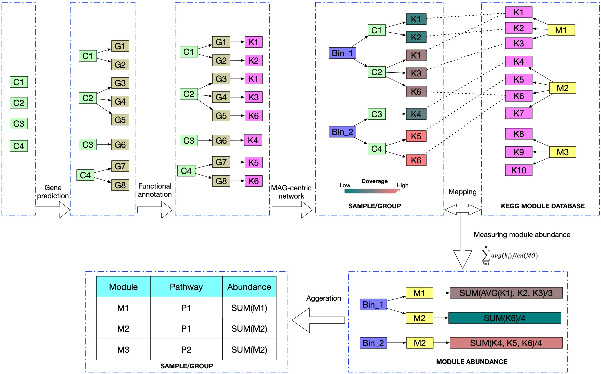
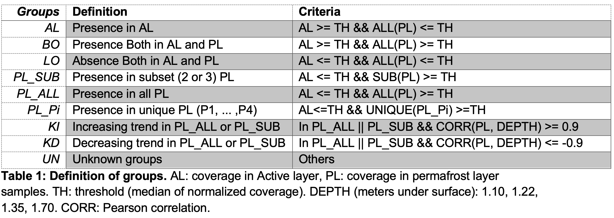

# Coverage-based functional analysis 
A example of how to investigate functional potential potential based on coverage with a MAG-centric view.



# Introduction
We developed a novel comparative strategy for investigating functional potential based on coverage in a MAG-centric view (See workflow above). 

Generally, metagenomic functional analysis was achieved by mapping short reads or assembled contigs with predicted genes against reference databases followed by parsing the result in gene or pathway level approaches. Gene-by-gene approaches utilizes most dominant gene products while overlooking the fact that biological functions rely on multiple genes while only part of them may be significantly abundant. For another, pathway-level analysis can miss nuanced differences in  functional variance as a core pathway could contain many shared sub-pathways or genes. 

Consequently we deployed comparative analysis strategy that utilizes KEGG Modules, a collection of manually defined functional units with several KO identifiers, which is commonly used to represent functional components. Comparing with pathway or gene enriched analysis, module-based analysis is able to provide a resolution for phenotypic features and link to specific metabolic capacity. Coverage is another important metagenomic characteristic that is currently not used beyond binning assembled contigs into MAGs. Taking all these into account, our novel comparative strategy for investigating functional potential based on coverage with a MAG-centric view captured several trends in Svalbard permafrosts. 

Although we have focused on permafrost metagenomics in this work, similar strategies applied here are applicable to other metagenomic studies, especially for well-characterized environments such as human gut with more accurate taxonomic classification and available MAGs.

# Dependencies
* Python 3.4 or higher
* R 3.5.0 or higher
* Python packages: pandas, numpy
* R packages: data.table
* Bioinformatic tools: BBMAP, Prodigal, GhostKOALA

# Example

Here we show a example of how to achieve this analysis with Svalbard permafrost metagnome. There are five samples in our dataset: sample_ids = ['2-1-2', '2-8-2', '2-9-2', '2-10-2', '2-12-2']. 


## Calculate mapping statistics (coverage, # of mapped reads, etc)    


Firstly, we merged contigs of all MAGs (all_bins.ctg.fasata), and then mapped using BBMAP to get mapping statistics(covstat, scafstat, statsfile) for each sample (see example below). Please add 'nzo=f' to make sure BBMAP will print contig with all coverage rather than only nonzero coverage.  

```
bbmap.sh ref=all_bins.ctg.fasta in1=2-1-2.R1.fa in2=2-1-2.R2.fa nzo=f ow=t threads=40 sortscafs=t scafstats=2-1-2.scafstats.txt covstats=2-1-2.covstats.txt statsfile=2-1-2.statsfile.txt 2> 2-1-2_map.log
```

## Merge coverage, and normalize coverage with TPM       

'./mapping_stats/' is the storage folder of your mapping statistics files.       
'samples_mapnum.txt' is a two columns tab-separated file: sample_id, total mapped reads (calculate from statsfile)   
'scaf2bin.txt' is a two columns tab-separated file: Contig_ID, Bin_ID 
```
> ls ./mapping_stats
2-1-2.covstats.txt   2-10-2.covstats.txt   2-12-2.covstats.txt   2-8-2.covstats.txt   2-9-2.covstats.txt
2-1-2.scafstats.txt  2-10-2.scafstats.txt  2-12-2.scafstats.txt  2-8-2.scafstats.txt  2-9-2.scafstats.txt
2-1-2.statsfile.txt  2-10-2.statsfile.txt  2-12-2.statsfile.txt  2-8-2.statsfile.txt  2-9-2.statsfile.txt
> head samples_mapnum.txt
2-1-2 9171534
2-8-2 11601008
2-9-2 16526122
2-10-2  18675925
2-12-2  17859538
> head scaf2bin.txt
k127_34665	metabat.113
k127_105473	metabat.113
k127_137477	metabat.113
k127_201593	metabat.115
```
This script will parse all coverage table of your input folder, add Bin_ID, merge into one coverage table, and normalize coverage by TPM caling factor(total mapped read counts divided with 1 million) for each sample.   
It will generate two output files:         
'ctg_bin_cov.csv' is the raw merged coverage table;         
'ctg_bin_cov.norm.csv' is the normalized coverage table.             

```
> python merge_and_norm_cov.py -i ./mapping_stats/ -s samples_mapnum.txt -m scaf2bin.txt

> head ctg_bin_cov.csv
Contig_ID	Bin_ID	2-1-2.raw_fold	2-8-2.raw_fold	2-9-2.raw_fold	2-10-2.raw_fold	2-12-2.raw_fold
k127_105473	metabat.113	3.5285	9.5581	48.0713	6.8607	10.2174
k127_137477	metabat.113	0.0493	19.4976	24.8368	8.5662	45.1643
k127_201593	metabat.113	0.0573	2.5481	52.6891	0.6004	0.72
> head ctg_bin_cov.norm.csv
Contig_ID	Bin_ID	2-1-2.norm_fold	2-8-2.norm_fold	2-9-2.norm_fold	2-10-2.norm_fold	2-12-2.norm_fold
k127_105473	metabat.113	0.38472299181358327	0.8239025436410353	2.9088070389411382	0.36735529833194336	0.5720976656842971
k127_137477	metabat.113	0.0053753276169504465	1.6806815407764566	1.5028813172261466	0.45867607628537815	2.528861608850128
k127_201593	metabat.113	0.00624759173329129	0.21964470673582845	3.1882313346107454	0.03214834071137039	0.040314592684312436

```

## Assign contigs into groups based on their normalized coverage distribution
We pre-defined several groups combining the coverage patterns with geographical significance.


Normal groups: ['AL','BO','PL_SUB','PL_ALL','PL_P1','PL_P2','PL_P3','PL_P4','LO','UN']    
Special groups: ['KI','KD']    

This Rscript will parse 'ctg_bin_cov.norm.csv' and assign each contigs into above groups. Please notice that our grouping functions are based on 5 svalbard samples, but you could  modify the code easily to build your own grouping functions. 
```
Rscript group_ctg_by_norm_cov.R
```
It will generate two output files:   
'NORM_group.csv' is the comma-separated file of contigs in normal groups and their coverage : Contig_ID, Bin_ID, groups,coverage   
'SPE_group.csv' is the comma-separated file of contigs in special groups and their coverage : Contig_ID, Bin_ID, group, coverage   
```
> head NORM_group.csv
Contig_ID,Bin_ID,group,2-1-2.norm_fold,2-8-2.norm_fold,2-9-2.norm_fold,2-10-2.norm_fold,2-12-2.norm_fold
k127_105473,metabat.113,PL_SUB,0.384722991813583,0.823902543641035,2.90880703894114,0.367355298331943,0.572097665684297
k127_240316,metabat.113,PL_ALL,0.411119884634348,1.01242064482673,0.997039716879737,1.01335275227331,0.850985059075996
k127_333437,metabat.113,BO,0.537859860738673,1.5774060323034,3.3252749798168,0.608724869049324,0.994085065358354
> head SPE_group.csv
Contig_ID,Bin_ID,group,2-1-2.norm_fold,2-8-2.norm_fold,2-9-2.norm_fold,2-10-2.norm_fold,2-12-2.norm_fold,SPE_group
k127_22792,metabat.179,PL_SUB,0.140936074597772,1.82378979481783,0.723382049339827,15.7402966653593,0.389153403632278,KI
k127_26430,metabat.179,PL_SUB,0.129880126923152,1.6135063435867,0.603069492044171,16.9823234993715,0.287868588761927,KI
k127_64248,metabat.179,PL_ALL,0.291172665336028,2.17412142117306,0.896483760679003,17.604530967007,0.537964643878246,KI

```

## Calculate module abundance in each group with a MAG-centric view

* Gene prediction
```
> prodigal -i all_bins.ctg.fasta -f gff -p meta -o all_bins.ctg.genes -a all_bins.ctg.prodigal.gene.faa
```
* Get KEGG gene annotation results
Upload 'all_bins.ctg.prodigal.gene.faa' to GhostKOALA (https://www.kegg.jp/ghostkoala/) to obtain gene-based KEGG annotation results 'gene_ko_anno_ghostkoala.txt'.
```
> head gene_ko_anno_ghostkoala.txt
k127_2851_1	K03496
k127_2851_2	K01918
k127_3198_1
k127_3198_2	K19055
k127_3198_3	K05838
k127_10351_1
k127_10351_2	K02849
k127_10351_3
```
* Download KEGG module database 'ko00002.keg' from KEGG webiste.     

* Calculate module abundance of groups with a MAG-centric view.      

```
> python calculate_module_abundance_per_group.py -gk gene_ko_anno_ghostkoala.txt -ko ko00002.keg -cg NORM_group.csv
```

The script 'calculate_module_abundance_per_group.py' will:
1) Obtain Kegg module information
2) Convert gene-based KO annotation to contig-based KO annotation
3) Detect existed modules by search KO overlaps
4) Calculate module abundance for each group in a MAG-centric view
5) Generate module abundance table for each group   

Please notice that input coverage table '-cg' is supporting multiple samples with your own coverage-group table, but headers of first three columns need to be : 'Contig_ID', 'Bin_ID', 'group'.    


It will generate the final output file 'module_abundance_per_group.csv' to record each module's abundance per group.   
```
> head module_abundance_per_group.csv
module_id,AL,BO,LO,PL_ALL,PL_P1,PL_P2,PL_P3,PL_P4,PL_SUB,UN,module_anno
M00119,14.547502498398673,18.540198037978385,3.2369715065271345,40.56229556414226,2.688729318142015,1.0998614178648407,1.1734430867038539,5.91916439234577,42.965435192662554,7.9435435001417165,"Pantothenate biosynthesis, valine/L-aspartate => pantothenate [PATH:map00770 map01100 map01110]"
M00080,4.140475423558032,2.393736785159976,0.6677998871085606,4.614304865477866,0.2083344317997251,,0.46412165732875005,1.024715052006364,5.781767244396411,1.0437647814505975,"Lipopolysaccharide biosynthesis, inner core => outer core => O-antigen [PATH:map00540 map01100]"
M00237,5.360651244413878,47.096112636051515,3.518077128591841,93.01618715816905,2.5279572448939973,0.49808514826796924,0.3920927950182258,2.688530724555236,53.75560499778051,4.279749561614213,Branched-chain amino acid transport system [PATH:map02010] [BR:ko02000]
M00022,13.722901906067653,8.974117749209022,2.3697324517044014,25.758456822434333,2.0382777580247344,1.4058187983433923,1.365257395536771,4.111569553305457,29.989880343651063,2.5787238704971926,"Shikimate pathway, phosphoenolpyruvate + erythrose-4P => chorismate [PATH:map00400 map01230 map01100 map01110 map01130]"
M00335,17.772486666644905,32.879956599311726,3.122522192935662,34.791934112490004,2.2059218926102098,1.7320168349471106,1.1127508687096623,7.0285652320939365,33.894350511977485,5.9890065009252105,Sec (secretion) system [PATH:map03070] [BR:ko02044]
```
Now you could evalulate and compare module's abundance across groups :)! 

