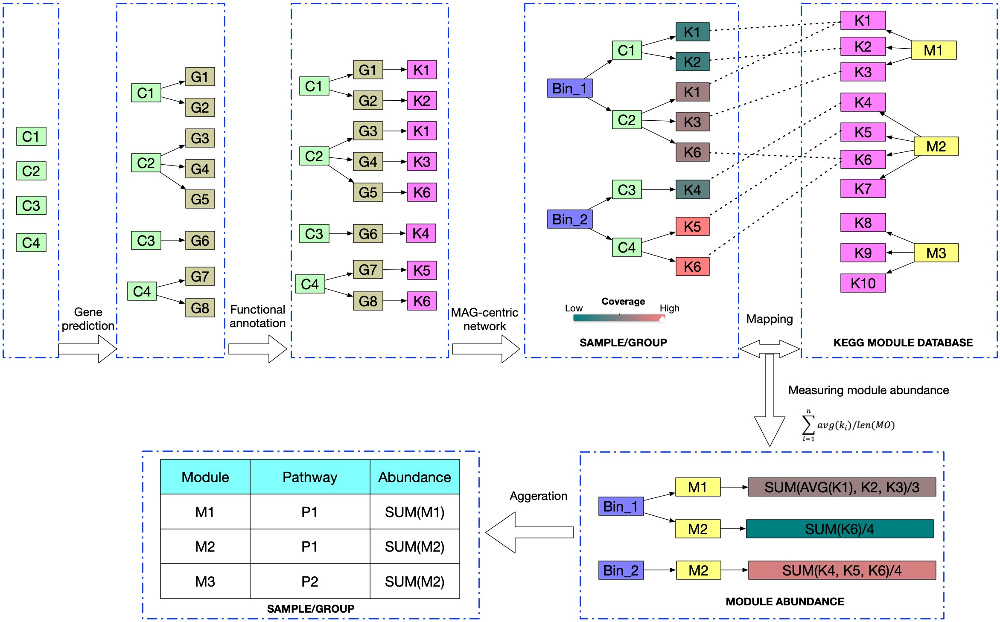

# Coverage-based-functional-analyisis-in-a-MAG-centric-view
A example of how to investigate functional potential potential based on coverage with a MAG-centric view.

# Introduction

# Example
* Mapping

